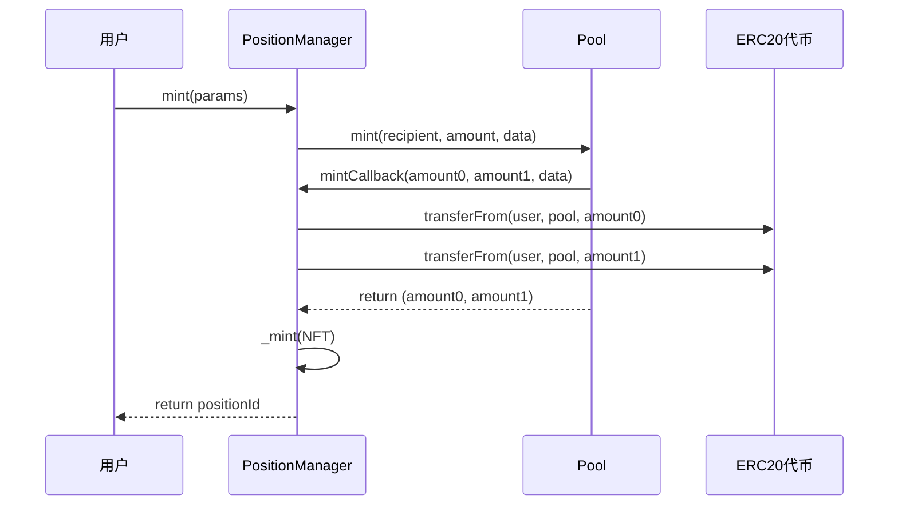
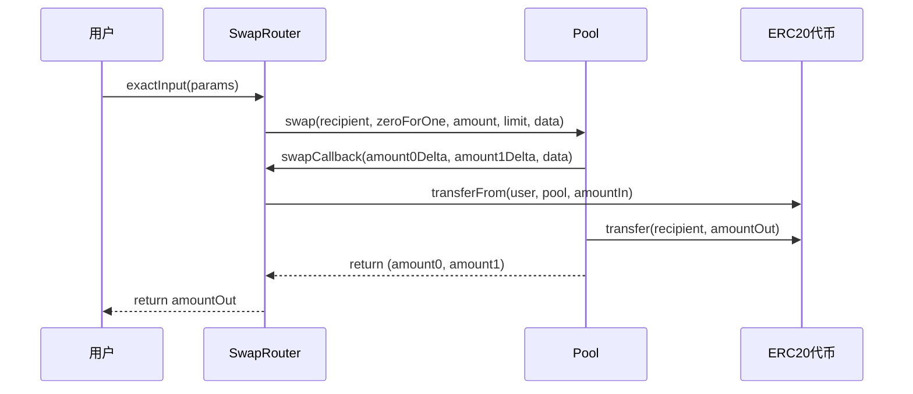

# MetaNodeSwap - 去中心化交易所 (DEX)

## 📋 项目概述

MetaNodeSwap 是一个基于 Uniswap V3 架构的去中心化交易所，实现了集中流动性自动做市商 (Concentrated Liquidity AMM) 功能。该项目支持代币交换、流动性提供、NFT化头寸管理等核心 DeFi 功能。

## 🏗️ 项目架构

### 核心合约架构图

```
┌─────────────────────────────────────────────────────────────┐
│                    MetaNodeSwap 架构                        │
├─────────────────────────────────────────────────────────────┤
│                                                             │
│  ┌─────────────────┐    ┌─────────────────┐                │
│  │   SwapRouter    │    │ PositionManager │                │
│  │   (交换路由)     │    │   (头寸管理)     │                │
│  └─────────┬───────┘    └─────────┬───────┘                │
│            │                      │                        │
│            └──────────┬───────────┘                        │
│                       │                                    │
│            ┌─────────────────┐                             │
│            │   PoolManager   │                             │
│            │   (池子管理)     │                             │
│            └─────────┬───────┘                             │
│                      │                                     │
│            ┌─────────────────┐                             │
│            │     Factory     │                             │
│            │    (工厂合约)    │                             │
│            └─────────┬───────┘                             │
│                      │                                     │
│            ┌─────────────────┐                             │
│            │      Pool       │                             │
│            │   (流动性池)     │                             │
│            └─────────────────┘                             │
│                                                             │
└─────────────────────────────────────────────────────────────┘
```

### 合约层次结构

1. **Factory (工厂合约)**
   - 负责创建和管理流动性池
   - 使用 CREATE2 确保池子地址的确定性
   - 支持同一代币对创建多个不同参数的池子

2. **Pool (流动性池)**
   - 实现核心的 AMM 逻辑
   - 管理流动性和代币交换
   - 处理手续费分配
   - 基于 tick 和 sqrtPriceX96 的价格体系

3. **PoolManager (池子管理器)**
   - 继承 Factory 功能
   - 提供池子信息聚合查询
   - 支持一站式池子创建和初始化

4. **SwapRouter (交换路由)**
   - 提供用户友好的交换接口
   - 支持精确输入和精确输出
   - 多池路径交换支持
   - 滑点保护机制

5. **PositionManager (头寸管理器)**
   - 使用 ERC721 NFT 表示流动性头寸
   - 管理流动性的添加、移除和收益提取
   - 基于 NFT 所有权的权限控制

## 🔧 核心功能

### 1. 流动性管理
- **添加流动性**: 通过 `mint` 函数向池子添加流动性
- **移除流动性**: 通过 `burn` 函数移除流动性
- **收取收益**: 通过 `collect` 函数提取手续费和代币

### 2. 代币交换
- **精确输入**: 指定输入代币数量，获得尽可能多的输出代币
- **精确输出**: 指定输出代币数量，使用尽可能少的输入代币
- **价格查询**: 支持交换前的价格预估
- **滑点保护**: 防止价格滑点超出用户容忍范围

### 3. 集中流动性
- **价格区间**: 流动性提供者可以指定价格区间
- **资本效率**: 相比传统 AMM 提供更高的资本效率
- **手续费优化**: 在活跃价格区间内获得更多手续费收益

### 4. NFT 化头寸
- **唯一标识**: 每个流动性头寸对应一个唯一的 NFT
- **可转让性**: NFT 可以自由转让，实现头寸的流动性
- **权限管理**: 基于 NFT 所有权的操作权限控制

## 📁 文件结构

```
swap-contract/
├── MetaNodeSwap/
│   ├── Factory.sol              # 工厂合约
│   ├── Pool.sol                 # 流动性池合约
│   ├── PoolManager.sol          # 池子管理合约
│   ├── SwapRouter.sol           # 交换路由合约
│   ├── PositionManager.sol      # 头寸管理合约
│   ├── interfaces/              # 接口定义
│   │   ├── IFactory.sol
│   │   ├── IPool.sol
│   │   ├── IPoolManager.sol
│   │   ├── ISwapRouter.sol
│   │   └── IPositionManager.sol
│   ├── libraries/               # 数学库和工具库
│   │   ├── TickMath.sol         # Tick 数学计算
│   │   ├── SqrtPriceMath.sol    # 价格平方根计算
│   │   ├── LiquidityMath.sol    # 流动性数学计算
│   │   ├── SwapMath.sol         # 交换数学计算
│   │   ├── FullMath.sol         # 完整精度数学
│   │   ├── FixedPoint128.sol    # 128位定点数
│   │   ├── FixedPoint96.sol     # 96位定点数
│   │   ├── SafeCast.sol         # 安全类型转换
│   │   ├── LowGasSafeMath.sol   # 低Gas安全数学
│   │   ├── TransferHelper.sol   # 代币转账助手
│   │   └── LiquidityAmounts.sol # 流动性数量计算
│   └── test-contracts/          # 测试合约
│       ├── TestSwap.sol         # 交换测试合约
│       ├── TestLP.sol           # 流动性测试合约
│       ├── TestToken.sol        # 测试代币合约
│       └── MNToken.sol          # MetaNode代币合约
└── README.md                    # 项目文档
```

## 🚀 部署流程

### 1. 环境准备

```bash
# 安装依赖
npm install

# 编译合约
npx hardhat compile
```

### 2. 部署脚本

```javascript
// scripts/deploy-dex.js
const { ethers } = require("hardhat");

async function main() {
    // 1. 部署 PoolManager (包含 Factory 功能)
    const PoolManager = await ethers.getContractFactory("PoolManager");
    const poolManager = await PoolManager.deploy();
    await poolManager.waitForDeployment();
    console.log("PoolManager deployed to:", await poolManager.getAddress());

    // 2. 部署 SwapRouter
    const SwapRouter = await ethers.getContractFactory("SwapRouter");
    const swapRouter = await SwapRouter.deploy(await poolManager.getAddress());
    await swapRouter.waitForDeployment();
    console.log("SwapRouter deployed to:", await swapRouter.getAddress());

    // 3. 部署 PositionManager
    const PositionManager = await ethers.getContractFactory("PositionManager");
    const positionManager = await PositionManager.deploy(await poolManager.getAddress());
    await positionManager.waitForDeployment();
    console.log("PositionManager deployed to:", await positionManager.getAddress());

    return {
        poolManager,
        swapRouter,
        positionManager
    };
}

main().catch((error) => {
    console.error(error);
    process.exitCode = 1;
});
```

### 3. 部署命令

```bash
# 本地部署
npx hardhat run scripts/deploy-dex.js --network localhost

# 测试网部署
npx hardhat run scripts/deploy-dex.js --network sepolia

# 主网部署
npx hardhat run scripts/deploy-dex.js --network mainnet
```

## 🧪 测试流程

### 1. 单元测试

```bash
# 运行所有测试
npx hardhat test

# 运行特定测试文件
npx hardhat test test/Factory.test.js
npx hardhat test test/Pool.test.js
npx hardhat test test/SwapRouter.test.js
```

### 2. 测试用例覆盖

- **Factory 测试**
  - 池子创建功能
  - 重复创建检查
  - 参数验证

- **Pool 测试**
  - 流动性添加/移除
  - 代币交换
  - 手续费计算
  - 价格更新

- **SwapRouter 测试**
  - 精确输入交换
  - 精确输出交换
  - 多池路径交换
  - 滑点保护

- **PositionManager 测试**
  - NFT 铸造/销毁
  - 权限验证
  - 头寸管理

### 3. 集成测试

```javascript
// test/integration.test.js
describe("DEX Integration Tests", function() {
    it("完整的流动性提供和交换流程", async function() {
        // 1. 创建池子
        // 2. 添加流动性
        // 3. 执行交换
        // 4. 验证结果
    });
});
```

## 📊 业务流程

### 1. 流动性提供流程



### 2. 代币交换流程



## 🔐 安全考虑

### 1. 重入攻击防护
- 使用 OpenZeppelin 的 ReentrancyGuard
- 状态更新在外部调用之前完成

### 2. 整数溢出防护
- 使用 SafeMath 库进行数学运算
- Solidity 0.8+ 内置溢出检查

### 3. 权限控制
- 基于 NFT 所有权的操作权限
- 多重签名管理员权限

### 4. 价格操纵防护
- 滑点保护机制
- 价格限制参数

## 🛠️ 开发工具

### 1. 开发环境
- **Hardhat**: 以太坊开发环境
- **OpenZeppelin**: 安全合约库
- **Ethers.js**: 以太坊交互库

### 2. 测试工具
- **Mocha**: 测试框架
- **Chai**: 断言库
- **Waffle**: 合约测试工具

### 3. 部署工具
- **Hardhat Deploy**: 部署插件
- **Hardhat Verify**: 合约验证

## 📈 性能优化

### 1. Gas 优化
- 使用 `staticcall` 进行余额查询
- 优化存储布局
- 批量操作支持

### 2. 计算优化
- 使用定点数数学库
- 预计算常用值
- 避免不必要的存储读写

## 🔄 升级机制

### 1. 代理模式
- 使用 OpenZeppelin 的升级代理
- 保持存储布局兼容性

### 2. 版本管理
- 语义化版本控制
- 向后兼容性保证

## 📞 联系方式

- **项目地址**: [GitHub Repository]
- **文档地址**: [Documentation]
- **社区讨论**: [Discord/Telegram]

## 📄 许可证

本项目采用 GPL-2.0-or-later 许可证。详见 [LICENSE](LICENSE) 文件。

---

**注意**: 本项目仅用于学习和研究目的。在生产环境中使用前，请进行充分的安全审计。
